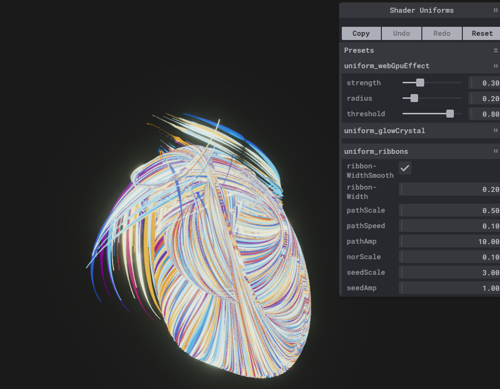
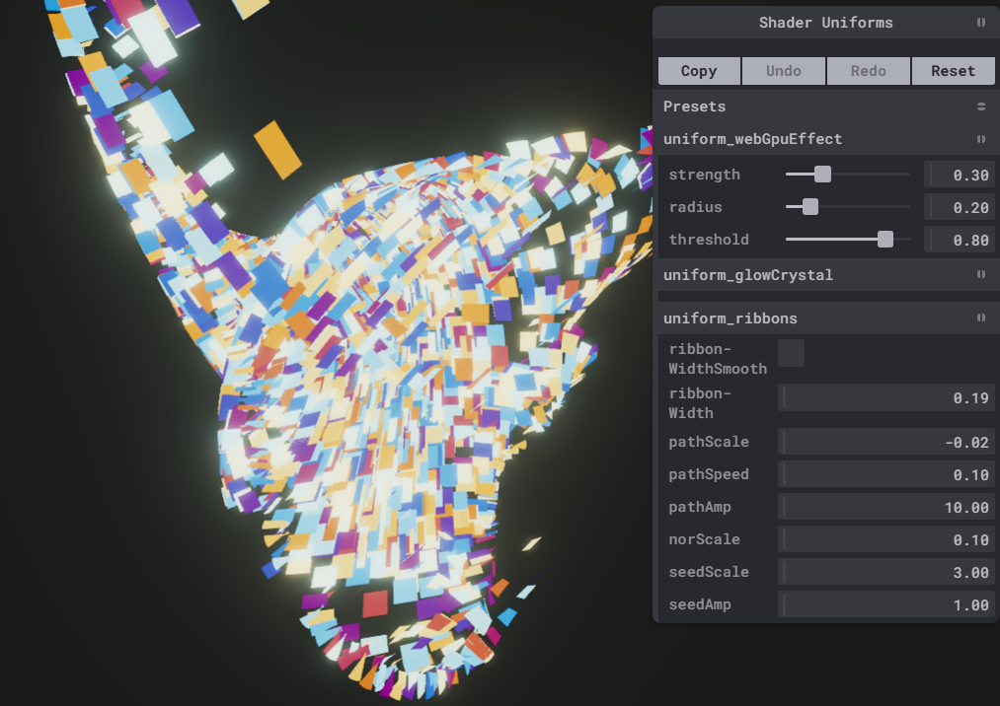
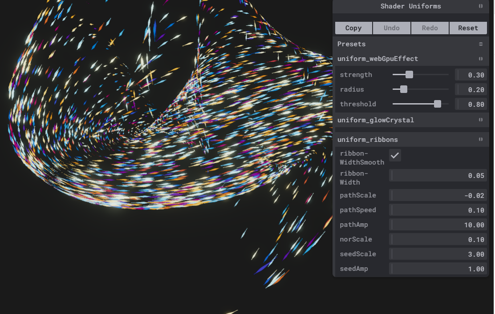

# gpu ribbons

> 使用tsl 计算节点构造了4000条缎带,每个缎带有101分段,101*2点. 计算节点COUNT: 4000x101

> 一句话解释: 使用mx_noise_vec3当作路径函数,获取当前缎带当前控制点的位置,法线,切线,副切线
 - 切线: 速度方向
 - 法线: 缎带朝向
 - 副切线: 缎带宽度延申方向

> 大量的缎带,太容易z-fight了,如果使用depthWrite: false又感觉很奇怪,缩小缎带长度,看上去还比较正常. 如果有个好看的路径函数就好了